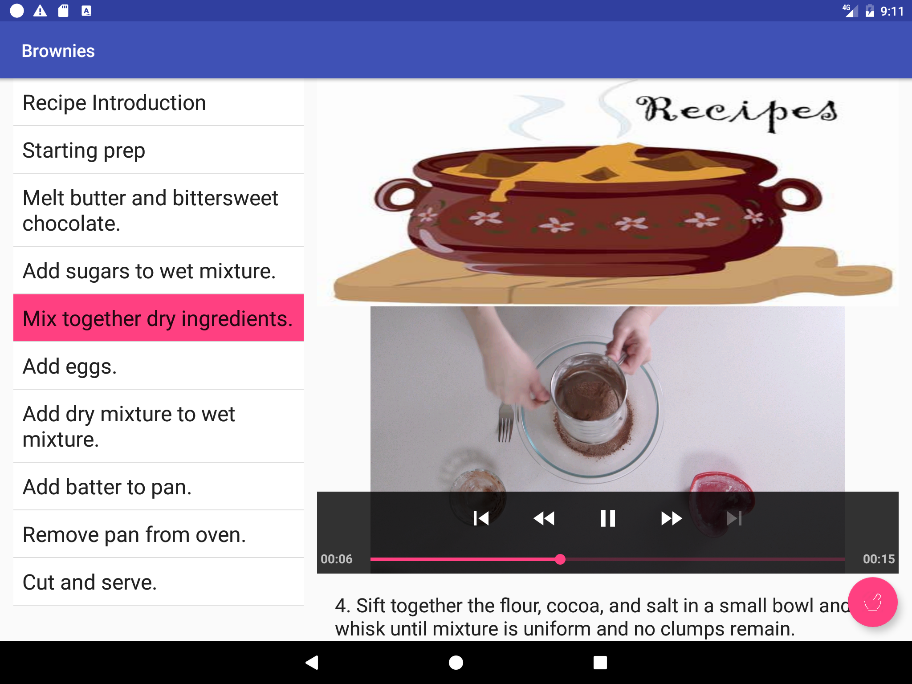
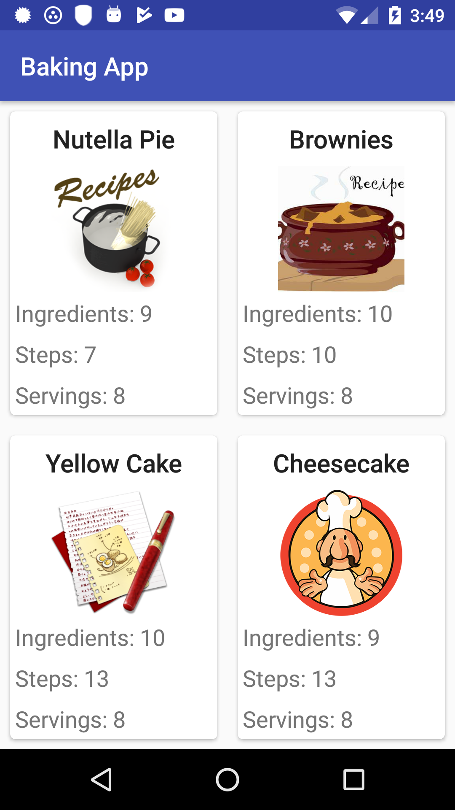
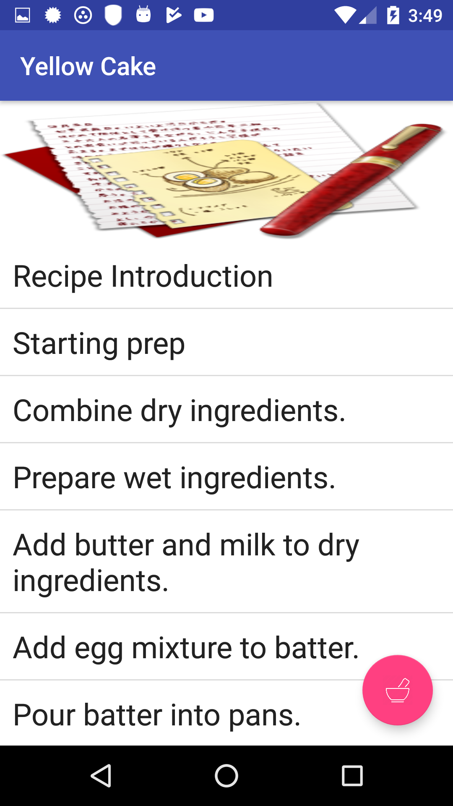
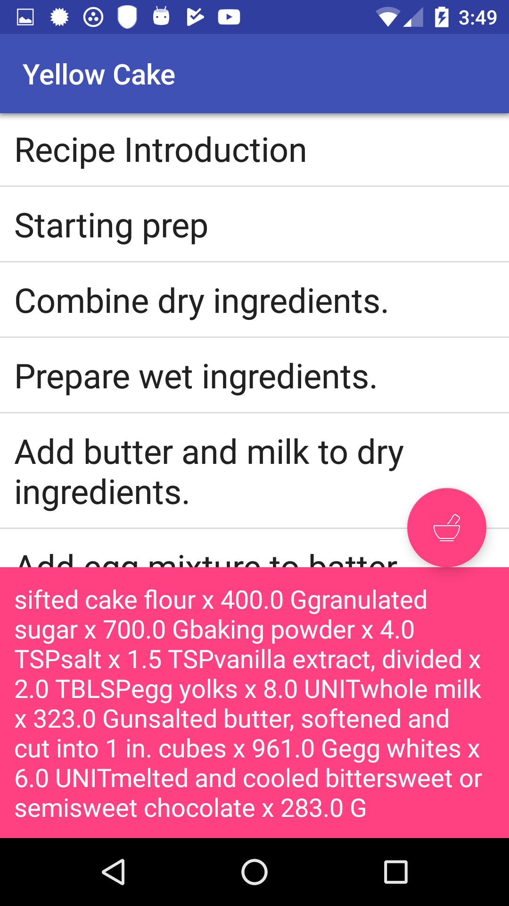
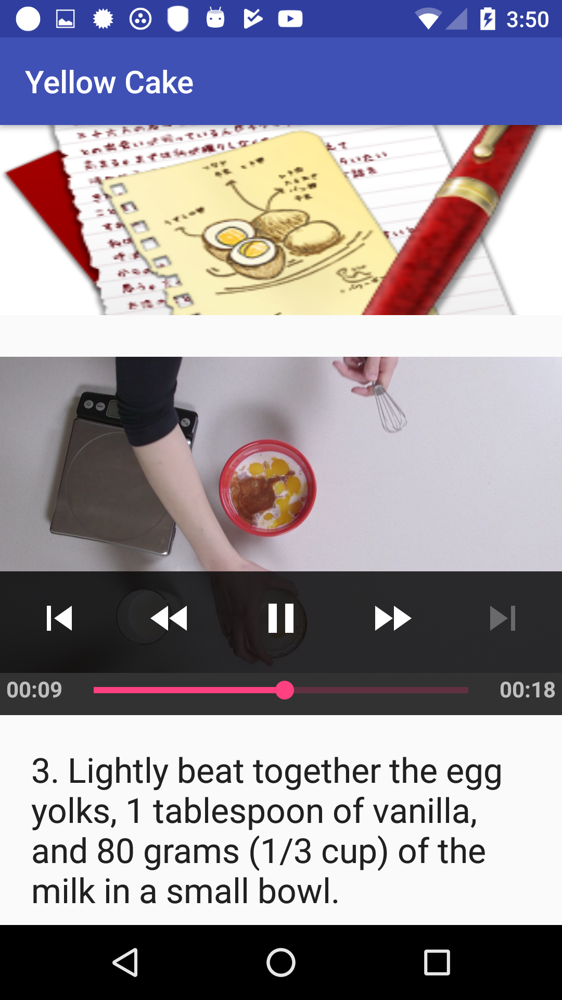

# Baking App
An Android app that allows a baker-in-chief to share recipes with the world. The app user can select a recipe
and see video-guided steps for hoe to complete it. The recipes' instructions, ingredients, videos, and images
are fetched from a JSON file hosted online.

The app also includes a homescreen widget to enhance the user's experience by displaying ingredient list
for a desired recipe.

The app uses a Master/Detail approach to create a responsive design that works on phones and tablets.

## Screenshots
### Tablet UI ###

### Phone UI ###   
    
    

### Built With
[Android Studio](https://developer.android.com/studio/index.html) - The IDE used  
[Gradle](https://gradle.org/) - Dependency Management  

### Libraries Used
[Glide](https://github.com/bumptech/glide) 
[Volley](https://github.com/google/volley) - Transmitting Networking Data  
[ExoPlayer](https://github.com/google/ExoPlayer) - Media Player  

### Contributing 
Pull requests are gracefully accepted.  

### License
The project is licensed under the MIT License - see [LICENSE.txt](LICENSE.txt) file for detail.
